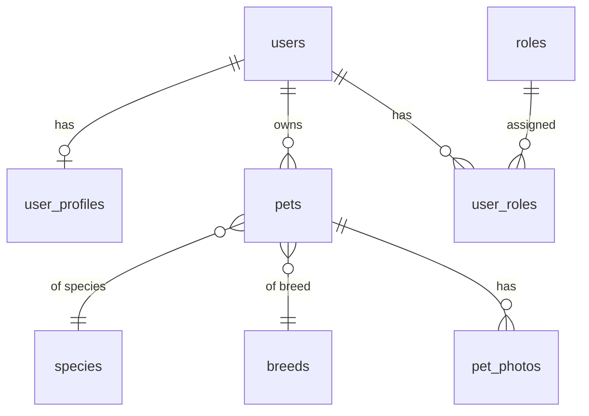

# Identity и Profile

[← к оглавлению БД](../DATABASE.md) · соглашения — [`00-conventions.md`](./00-conventions.md)

Модули: `Identity`, `Profile`. Бизнес-контекст — [`../plan/00-overview.md`](../plan/00-overview.md).

## `users`
| Поле | Тип | Примечание |
|---|---|---|
| id | ULID PK | |
| phone | varchar, unique | основной логин (РФ-номер) |
| email | varchar, unique, nullable | |
| password_hash | varchar | |
| account_type | enum(`owner`,`breeder`,`shelter`,`admin`,`moderator`) | базовая роль аккаунта, детальные права — `roles`/`user_roles` |
| status | enum(`active`,`blocked`,`pending_verification`) | |
| phone_verified_at | timestamptz nullable | |
| personal_data_consent_at | timestamptz | согласие на обработку ПД (152-ФЗ), обязательное поле при регистрации |
| created_at / updated_at / deleted_at | timestamptz | |

## `roles`, `user_roles`
Стандартная ролевая модель (совместима с пакетом `spatie/laravel-permission`):
`roles(id, name, guard_name)`, `user_roles(user_id, role_id)`.

## `user_profiles`
| Поле | Тип | Примечание |
|---|---|---|
| user_id | ULID PK/FK → users | 1:1 |
| display_name | varchar | |
| avatar_media_id | ULID FK → media, nullable | см. `07-notification-media-moderation.md` |
| city | varchar nullable | |
| location | geography(point) nullable | для радиуса подбора |
| bio | text nullable | |
| birthdate | date nullable | |

## `pets` (анкета питомца)
| Поле | Тип | Примечание |
|---|---|---|
| id | ULID PK | |
| owner_id | ULID FK → users | |
| species_id | FK → species | см. `02-catalog.md` |
| breed_id | FK → breeds, nullable | |
| name | varchar | |
| sex | enum(`male`,`female`) | |
| birthdate | date nullable | |
| purpose | enum(`social`,`breeding`,`for_sale`,`shelter`) | к какому флоу относится анкета |
| description | text nullable | |
| health_notes | text nullable | прививки, стерилизация и т.п. |
| is_vaccinated | boolean default false | |
| status | enum(`active`,`hidden`,`archived`) | |
| created_at / updated_at / deleted_at | timestamptz | |

## `pet_photos`
`id, pet_id FK, media_id FK → media, position smallint, created_at`.

Листинги на продажу (`Marketplace`) и карточки в приюте (`Shelter`) **ссылаются на
`pets`** (через `pet_id`), а не дублируют данные о животном — см.
[`04-shelter.md`](./04-shelter.md) и [`05-marketplace-payment.md`](./05-marketplace-payment.md).
