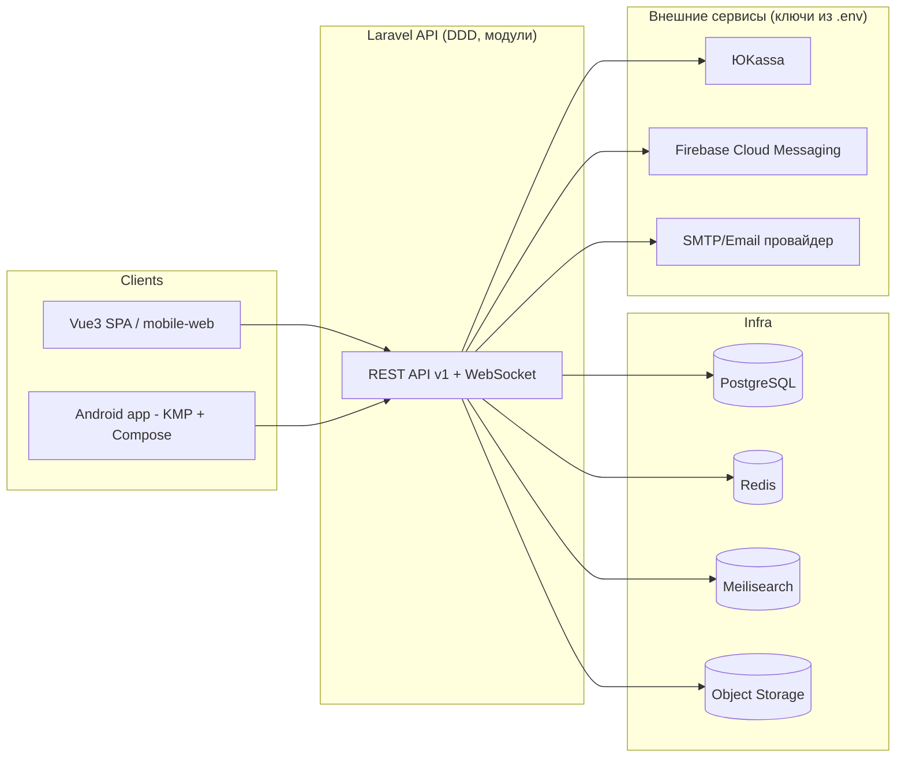

# Общая архитектура

[← к оглавлению плана](../PLAN.md)

Все внешние адаптеры (ЮKassa, FCM, S3, SMTP) реализуются как порты/интерфейсы в
`Domain`/`Application`-слое соответствующего модуля и адаптеры в `Infrastructure` —
подмена провайдера не должна требовать правок бизнес-логики.

Список модулей (bounded contexts), из которых состоит `Backend`, — в
[`01-modules.md`](./01-modules.md). Правило межмодульного взаимодействия (только через
события/явные контракты, без прямых импортов чужих Eloquent-моделей) обязательно к
соблюдению и на бэкенде, и логически отражается в разделении `entities/features` на
фронтенде.

## Единый бэкенд и единая БД для сайта и мобильного приложения

Веб (Vue3 SPA) и Android-приложение (KMP) — это два независимых **клиента одного и того
же** Laravel API и одной и той же PostgreSQL БД. Никакого отдельного «мобильного бэкенда»,
отдельной БД для приложения или локальной репликации бизнес-данных не существует и не
планируется: и лайк/мэтч, и сделка с эскроу, и подписка — это одна транзакция в одной базе,
видимая обоим клиентам сразу после ответа API.

Следствия для реализации:

- Мобильное приложение (`shared/data/network`, см.
  [`06-mobile-structure.md`](./06-mobile-structure.md)) обращается **только** к REST API
  v1 и WebSocket того же бэкенда, что и фронтенд — никаких прямых подключений к БД,
  собственных копий бизнес-правил или дублирующих эндпоинтов «для мобилки».
- Локальная БД в мобильном приложении (SQLDelight) — это кэш/офлайн-буфер конкретного
  устройства, а не источник истины; конфликты разрешаются в пользу сервера.
- Все инварианты, критичные для денег и состояния сделки (эскроу, авто-подтверждение,
  комиссия), проверяются исключительно на сервере в транзакциях БД — клиент не может
  привести систему в невалидное состояние даже при гонке между сайтом и приложением одного
  пользователя.
- Масштабирование апи-слоя (несколько подов/контейнеров `api`) — горизонтальное и
  stateless; состояние — только в PostgreSQL/Redis. Подробности — в
  [`12-infrastructure.md`](./12-infrastructure.md) и [`../DEPLOY.md`](../DEPLOY.md).
