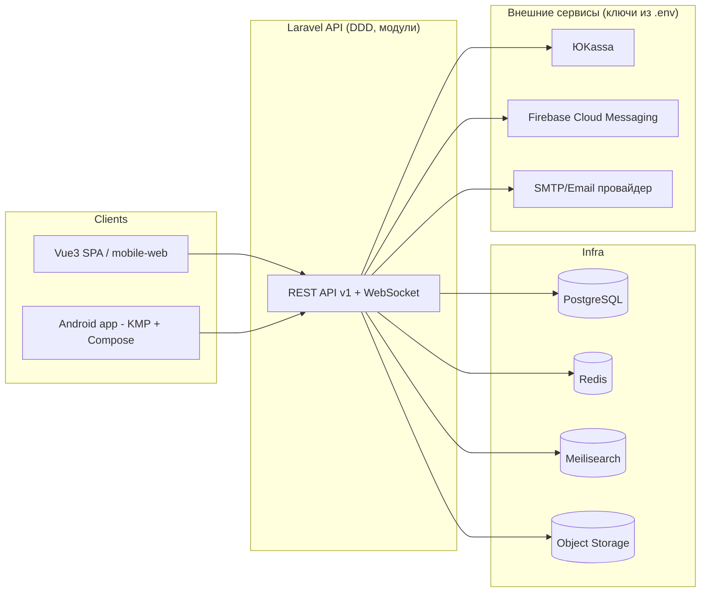

# Общая архитектура

[← к оглавлению плана](../PLAN.md)

Все внешние адаптеры (ЮKassa, FCM, S3, SMTP) реализуются как порты/интерфейсы в
`Domain`/`Application`-слое соответствующего модуля и адаптеры в `Infrastructure` —
подмена провайдера не должна требовать правок бизнес-логики.

Список модулей (bounded contexts), из которых состоит `Backend`, — в
[`01-modules.md`](./01-modules.md). Правило межмодульного взаимодействия (только через
события/явные контракты, без прямых импортов чужих Eloquent-моделей) обязательно к
соблюдению и на бэкенде, и логически отражается в разделении `entities/features` на
фронтенде.
