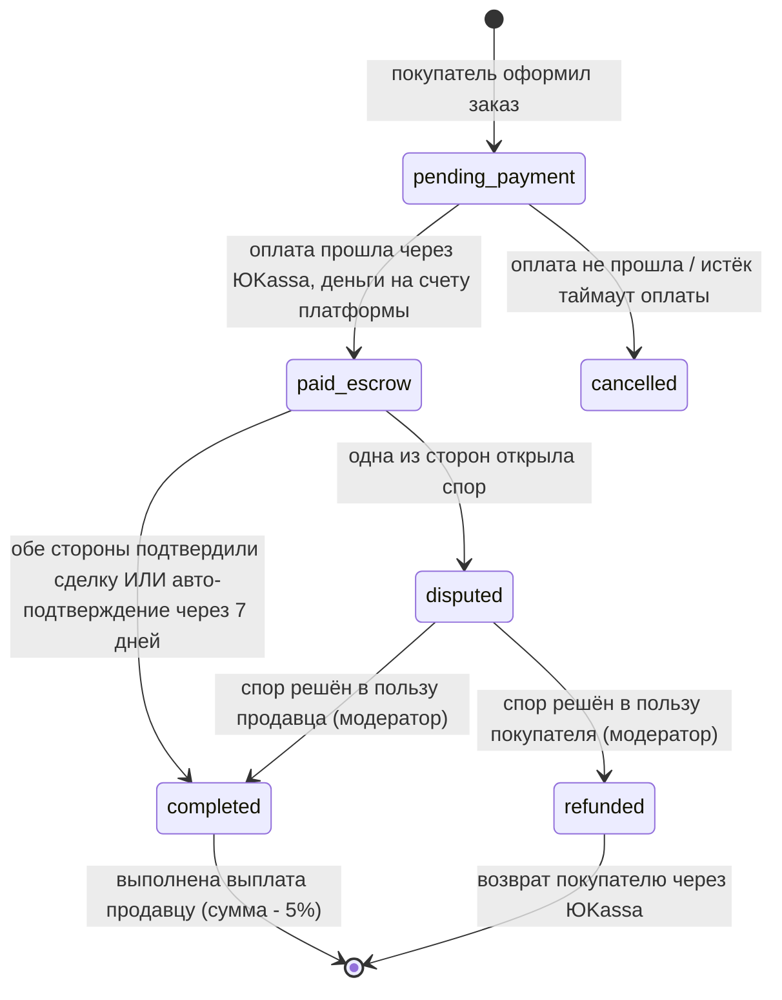

# Бизнес-флоу: маркетплейс и эскроу-сделка

[← к оглавлению плана](../PLAN.md)

Состояния сделки (Order) — строгая машина состояний в Application-слое модулей
`Marketplace` и `Payment`:

## Правила

- Комиссия платформы — **5%** от суммы сделки, удерживается при выплате продавцу.
- Способ приёма денег: деньги при оплате поступают на **расчётный счёт платформы** через
  обычный приём платежей ЮKassa (без разделения на суб-магазины); отдельные суб-счета
  продавцов не создаются — решение зафиксировано, см. `00-overview.md` (открытые вопросы —
  не про это, это решено).
- Выплата продавцу — после `completed`, выполняется через `payouts` (ЮKassa Выплаты либо
  вручную) — см. правила в [`../rules/04-payments-escrow.md`](../rules/04-payments-escrow.md).
- Запланированная задача (`php artisan deals:auto-confirm`, каждый час через Scheduler)
  переводит все `paid_escrow`-сделки старше 7 дней в `completed`, если ни одна сторона не
  инициировала спор.
- Каждая смена статуса пишется в историю (`order_status_history`) — для аудита и поддержки.
- Все обращения к ЮKassa идемпотентны (idempotency key = order id + шаг), вебхуки
  проверяются по подписи и обрабатываются в очереди (не синхронно в HTTP-запросе).

Модули: `Marketplace`, `Payment`, `Moderation` (споры). Таблицы —
[`../database/05-marketplace-payment.md`](../database/05-marketplace-payment.md).
